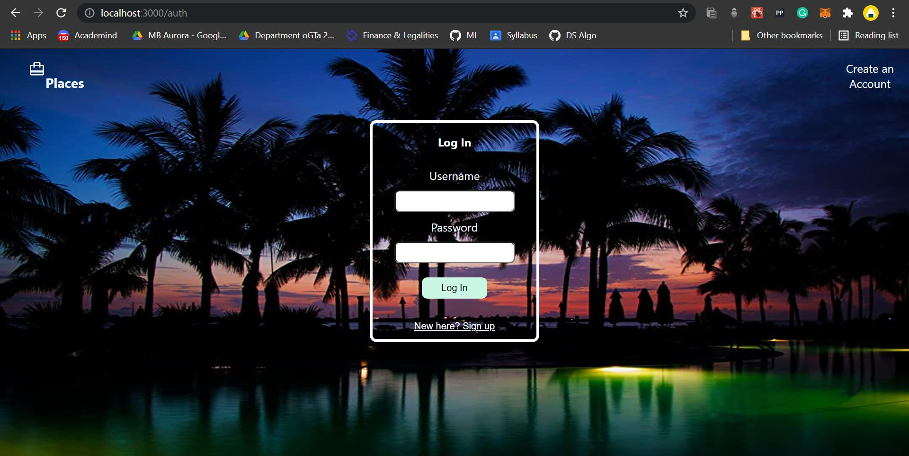
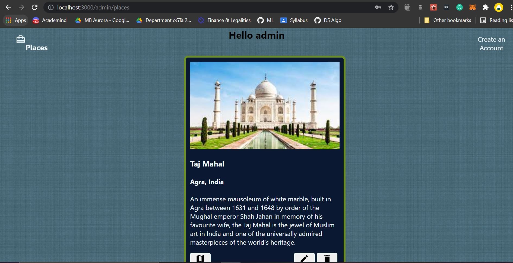

# Places Web App
  
Technologies used:
1. ReactJS (Frontend)
2. Material UI (Styling)
3. NodeJS with express (Backend)
4. MongoDB (Database)

How to run:
1. Clone/Download this repository to your local system.
2. cd into the project folder and run the command `npm i` to install all the required dependencies.
3. To run the development server use the command `npm run dev`.
4. To run just the client side cd into the client folder and use `npm start`

How it works:
A user can register to Places and then log into their account. After which they get an option to add a post.
Doing so will create a post with the details of the place and there are 3 options with it. You can either edit it, delete it or view it on map (using Google Maps API).

Snapshots:

